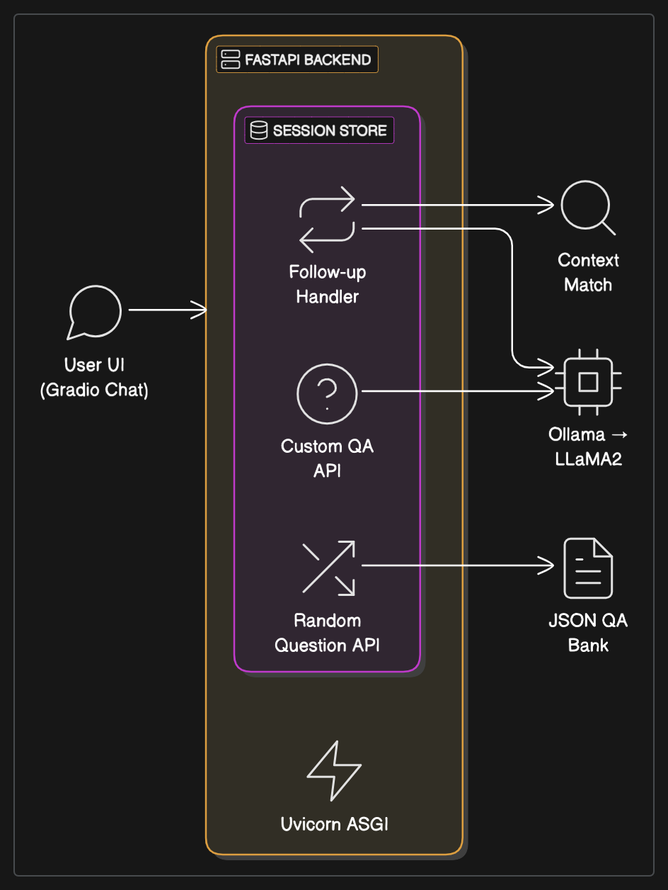
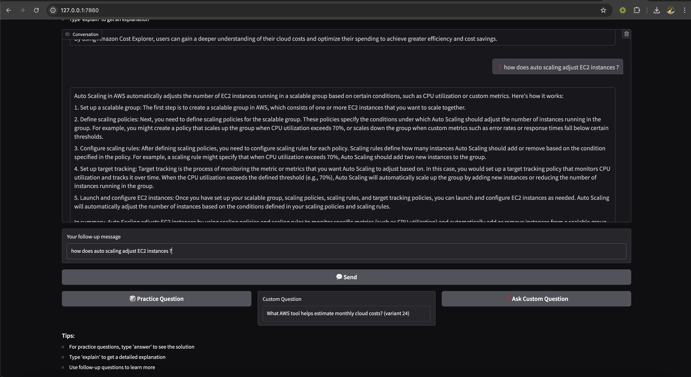
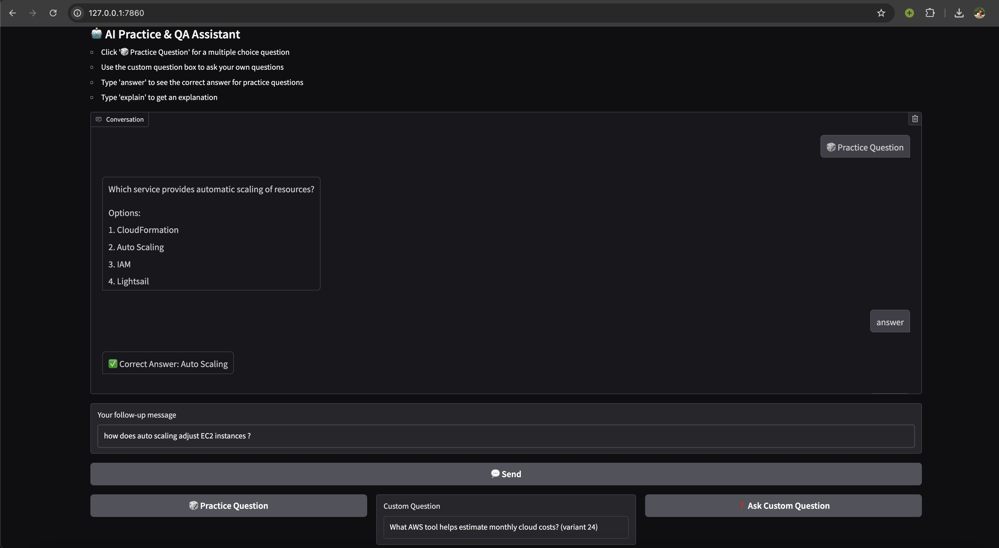
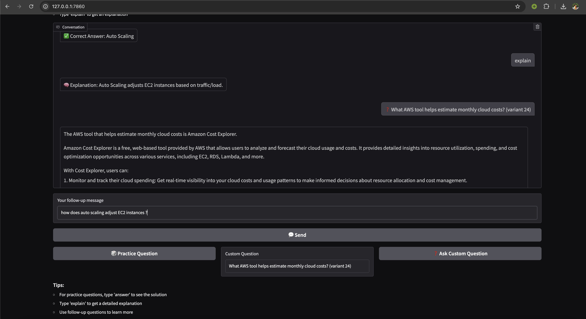

# AI Agent to prepare for certification programs

## This is a pretest model for the LFX CNCF-WasmEdge Mentorship project. 

This repo demonstrates an AI Agent prototype that mimics an MCP-backed system using FastAPI and Gradio, powered by llamaedge framework. It features contextual follow-ups, intellegent prompt routing and a chat-style frontend via a local JSON QA bank.

## Key Highlights

### 1. Chat Interface  
Uses Gradio to create a real-time conversation panel featuring:  
a. **Practice Question** button that generates random questions, answers and explanation via the random_question() endpoint.  
b. **Ask Custom question** button that receives a question entered by the user and fetches answer and explanation via the get_question_and_answer() endpoint.  
c. **Follow-Up** for any other conversation based on the session context. 

### 2. LLM-Powered Response with Session Context  
Custom Questions are answered using LLaMA2 via Ollama with responses managed per user session (UUID based).

### 3. Multi-turn Context Inference  

Enables context-aware follow-ups using TF-IDF cosine similarity. Keyword-based prompts like "answer" and "explain" default to the latest interaction, while complex queries trigger similarity search over session history to identify the most relevant context for coherent multi-turn responses.

### 4. Custom Certification Dataset 

Contains 60 MCQs along with answers and explanation stored in a json file for the AWS Certification Programme prep.  

A simple diagram explaining the system architecture:  

## Known Issue  
The context switching endpoint implemented in the pretest using sentence-transformers works only when called after the get_question_and_answer() function. 

## Screenshots of the frontend UI

  

  

Thank you for your time. I am excited to learn and grow through this mentorship opportunity. I'd be happy to improvise based on your feedback or suggestions!
